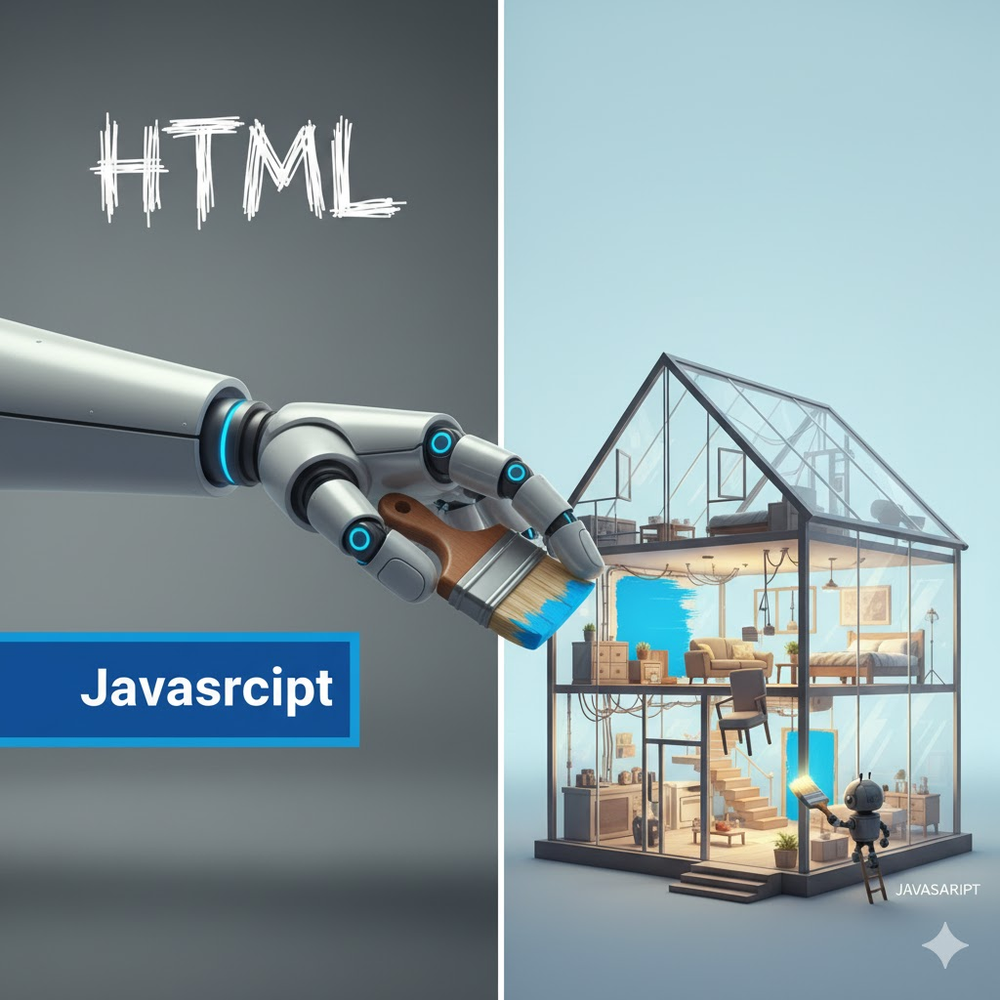
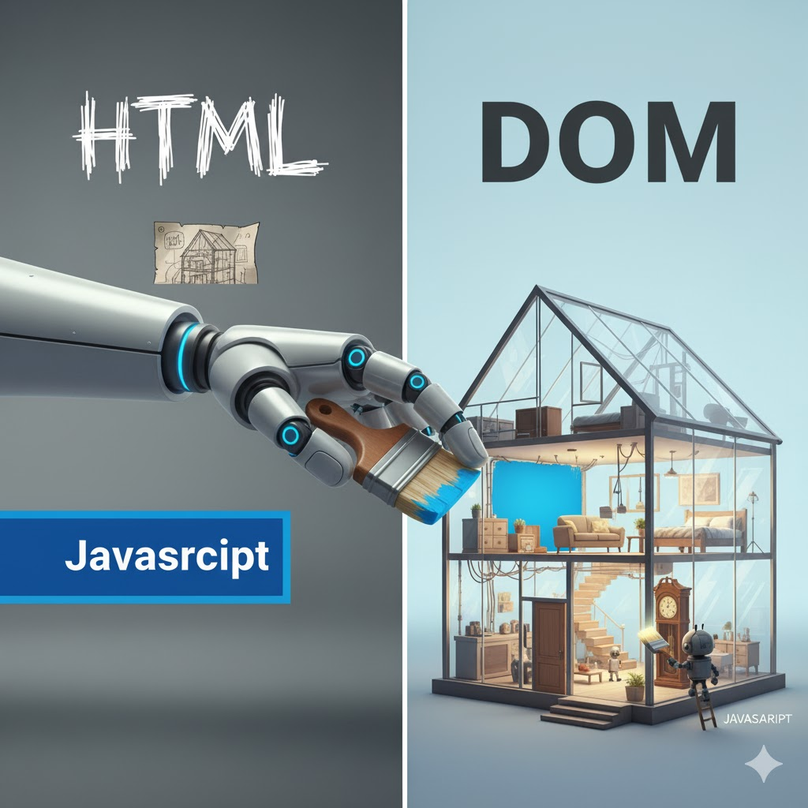

# 🌳 Welcome to the HTML DOM Forest! 🌲

**By: Beauttah**

Ever wondered how websites come to life and change right before your eyes? That amazing magic is powered by the **HTML DOM**. If the DOM were a secret society, you're now one of the lucky few to understand its handshake! Prepare to unlock the secrets behind every interactive button, every dynamically updated piece of text, and every dazzling animation you see online.


---

## 🗺️ What is the HTML DOM? (The Blueprint Analogy)

The **DOM (Document Object Model)** is essentially a programming interface for HTML and XML documents. But what does that really mean? 

Imagine you have a beautifully crafted house. The HTML is like the initial architect's sketch and the pile of raw materials. The browser then takes those materials and sketches and builds the physical house. The DOM isn't the sketch or the materials; it's the **actual, structured house itself**, ready for you to walk through, rearrange furniture, or even add new rooms!

It provides a structured, tree-like representation of your web page, and it allows programs—specifically JavaScript—to access and change the document's structure, style, and content. Think of JavaScript as the incredibly skilled interior designer, renovator, or even the magical force that can instantly change aspects of the house.

### 🏠 Symbolism: The House Blueprint & The Living House

Let's break down the analogy:

- **HTML**: This is your raw building materials (wood, bricks, glass, wires) and the initial text document of your house plans (e.g., "build a wall here, add a window there"). It's static, just a description.

- **The Browser (or Parser)**: This is the architect, builder, and foreman all rolled into one. It takes your raw HTML instructions and, like a master craftsman, constructs the actual house in memory.

- **The DOM**: This is the resulting 3D, detailed, interactive model of the house that exists in the browser's memory. You can walk through it, inspect every room, and most importantly, modify it on the fly! It's the physical, structured house itself. It shows the exact hierarchy: "The roof is on the house, the door is in the wall, and the knob is on the door." This "living blueprint" is what JavaScript interacts with. JavaScript uses this blueprint to move the furniture, paint a wall, add a new room, or even demolish an old one!


### DOM Components Table

| Component | Real-World Analogy | DOM Role |
|-----------|-------------------|----------|
| **Document** | The entire House or Building Plot | The absolute root node; represents the whole HTML page (`<html>`). It's the starting point for all interactions. |
| **Elements** | The Walls, Doors, Windows, Roof, Floors | These are HTML tags like `<h1>`, `<p>`, `<div>`, ``, `<button>`. Each element is a distinct structural part of the page. |
| **Attributes** | The Color, Material, Size, Number, Finish | These are properties of elements, like `class="main"`, `src="image.jpg"`, `id="unique-id"`, `style="color: red;"`. They describe elements. |
| **Text Nodes** | The Words on a sign, the paint color of a wall | This is the actual textual content inside elements. For example, "Hello World!" within a `<p>Hello World!</p>`. |

---

## 👨‍👩‍👧‍👦 The DOM is a Family Tree (Tree Structure)

The most fundamental concept to grasp is the **DOM Tree**. Imagine your HTML document isn't just a flat list of tags, but a beautifully organized family tree, or an inverted tree where the root is at the top. Every single piece of your HTML—every tag, every piece of text, even comments—becomes a **node** in this tree.

- The **document** itself is the ultimate ancestor, the cosmic origin point of your web page.
- The `<html>` tag is the main parent, the "founding father" of your visible web content.
- `<head>` and `<body>` are its immediate children (and thus, siblings to each other).
- An `<h1>` tag located inside the `<body>` is a child of the `<body>` and a descendant of the `<html>` and document.
- Nodes at the same level (e.g., a `<p>` and a `<div>` both inside `<body>`) are siblings.

💡 **Key Takeaway**: This hierarchical, tree-like structure is precisely how JavaScript navigates and locates specific parts of your web page. It can "walk" the tree, going from a parent to a child, a child back to its parent, or between siblings.


### Example HTML Markup

Let's look at a simple HTML structure and how it translates into the DOM tree:

```html
<!DOCTYPE html>
<html>
<head>
    <meta charset="UTF-8">
    <title>My DOM Explorer</title>
</head>
<body>
    <header>
        <h1 id="main-title">Welcome to the DOM World!</h1>
        <p class="intro-paragraph">We're about to explore a powerful concept.</p>
    </header>
    <div id="content-area">
        <h2>About this guide</h2>
        <p class="section-text">This guide makes the DOM easy to understand.</p>
        <p class="section-text">Get ready for some interactive fun!</p>
    </div>
</body>
</html>
```

### Visualizing the DOM Tree (Simplified)

Here's how that HTML is mentally (and practically) represented as a tree by the browser:

```
DOCUMENT (The entire HTML page)
└── html (Root Element)
    ├── head
    │   ├── meta
    │   └── title (Text Node: "My DOM Explorer")
    └── body
        ├── header
        │   ├── h1 (id="main-title", Text Node: "Welcome to the DOM World!")
        │   └── p (class="intro-paragraph", Text Node: "We're about to explore a powerful concept.")
        └── div (id="content-area")
            ├── h2 (Text Node: "About this guide")
            ├── p (class="section-text", Text Node: "This guide makes the DOM easy to understand.")
            └── p (class="section-text", Text Node: "Get ready for some interactive fun!")
```

**Notice** how Text Nodes are also part of the tree! They are children of the elements they reside within.

---

## 🛠️ How JavaScript Uses the DOM (The Robot Hand)

JavaScript is your powerful, versatile robot hand that can interact with and manipulate the DOM blueprint. It uses a set of built-in methods to first **Select** one or more nodes (elements) and then **Manipulate** their properties, content, or even create entirely new elements.




### 1. Selecting Elements (Finding the Right Tool in the Toolbox)

Before you can change anything, you must find the specific element(s) you want to target. Think of this as having different tools for different finding tasks.

| Method | What it Selects | Symbolism | When to Use |
|--------|----------------|-----------|-------------|
| `document.getElementById('myId')` | The single element with a matching `id` attribute. Returns `null` if not found. | Finding the house with the unique number on the mailbox. Fast and reliable for single elements. | When you need to target one very specific, uniquely identified element. IDs must be unique on a page. |
| `document.getElementsByClassName('myClass')` | A live HTMLCollection (like an array) of all elements with a matching `class` attribute. | Finding all the houses painted blue on the street. | When you need to select multiple elements that share a common visual style or behavior. |
| `document.getElementsByTagName('div')` | A live HTMLCollection of all elements with a matching HTML tag name (e.g., 'p', 'a', 'img'). | Finding all the "sheds" or "garages" regardless of their color. | When you want to select all instances of a particular HTML tag. |
| `document.querySelector('#myId')`<br>`document.querySelector('.myClass')`<br>`document.querySelector('div.myClass')` | The **first** element that matches a specified CSS Selector string. (Very versatile!) | Finding the first thing that matches a very specific description (e.g., "The red door on the blue house"). | When you need the flexibility of CSS selectors and only need the first match. Great for targeting specific, complex combinations. |
| `document.querySelectorAll('.myClass')` | A static NodeList (like an array) of **all** elements that match a specified CSS Selector string. | Finding all things that match a very specific description. | When you need the flexibility of CSS selectors and want all matching elements. |

#### Code Examples: Selecting Elements

```javascript
// 1. Selecting by ID (returns a single element or null)
const mainTitleElement = document.getElementById('main-title'); 
console.log(mainTitleElement); 
// Output: <h1 id="main-title">Welcome to the DOM World!</h1>

// 2. Selecting by Class Name (returns a collection)
const paragraphs = document.getElementsByClassName('section-text');
console.log(paragraphs); 
// Output: HTMLCollection [p.section-text, p.section-text] (contains two <p> elements)
console.log(paragraphs[0]); // Access the first paragraph in the collection

// 3. Using querySelector (for the first match of a CSS selector)
const introParagraph = document.querySelector('.intro-paragraph');
console.log(introParagraph);
// Output: <p class="intro-paragraph">We're about to explore a powerful concept.</p>

// 4. Using querySelectorAll (for all matches of a CSS selector)
const allParagraphsInContentArea = document.querySelectorAll('#content-area p');
console.log(allParagraphsInContentArea);
// Output: NodeList [p.section-text, p.section-text] (contains the two <p> elements inside the div)

// You can also select tags directly
const allHeaders = document.getElementsByTagName('h2');
console.log(allHeaders[0]); // The first <h2> element
```

---

### 2. Manipulating Elements (Renovating the House)

Once you've selected an element, the real fun begins! You can change almost anything about it.




| Manipulation Task | JavaScript Code Example | Description | Symbolism |
|-------------------|------------------------|-------------|-----------|
| **Change Text Content** | `myElement.textContent = 'New text here!';` | Modifies the visible text inside an element. This is safe as it doesn't parse HTML. | Changing the words written on a sign or in a book. |
| **Change HTML Content** | `myElement.innerHTML = '<strong>Bold Text</strong> and more!';` | Modifies the entire HTML content inside an element. Use with caution as it parses HTML and can be a security risk with untrusted input. | Replacing an entire section of the house, including its internal structure. |
| **Change Inline Style** | `myElement.style.color = 'blue';`<br>`myElement.style.fontSize = '20px';` | Directly applies CSS styles to an element's `style` attribute. | Painting a wall blue, adjusting the size of a window. |
| **Add/Remove CSS Classes** | `myElement.classList.add('highlight');`<br>`myElement.classList.remove('old-style');`<br>`myElement.classList.toggle('active');` | Adds, removes, or toggles CSS classes on an element. This is the preferred way to change styles dynamically as it separates concerns. | Putting a "For Sale" sign on the house, taking down an old banner. |
| **Change Attributes** | `myElement.setAttribute('src', 'new-image.jpg');`<br>`myElement.getAttribute('src');` | Sets or retrieves the value of any HTML attribute (e.g., `src`, `href`, `id`, `alt`). | Changing the address on the mailbox, updating the material of a door. |
| **Create New Elements** | `const newDiv = document.createElement('div');` | Generates a new HTML element node in memory, but it's not yet on the page. | Building a new shed or a piece of furniture in your workshop. |
| **Add to the Page (Append)** | `parentElement.appendChild(newDiv);` | Inserts a created element as the last child of a specified parent element. | Physically placing the new shed into the backyard. |
| **Remove from the Page** | `myElement.remove();` | Removes an element from the DOM tree entirely. | Demolishing a shed or removing a piece of furniture. |

#### Code Examples: Manipulating Elements

```javascript
// 1. Select the main title element
const mainTitle = document.getElementById('main-title');

// 2. Change its text content
mainTitle.textContent = 'The DOM is YOUR playground!';

// 3. Add a new CSS class to style it differently (assuming you have 'highlight' in your CSS)
mainTitle.classList.add('highlight');

// 4. Create a brand new button element
const newButton = document.createElement('button');
newButton.textContent = 'Click Me to Reveal a Secret!';
newButton.id = 'secret-button'; // Give it an ID for later targeting

// 5. Select the content area to append our new button
const contentArea = document.getElementById('content-area');

// 6. Append the button to the content area
contentArea.appendChild(newButton);

// 7. Now, let's make the button do something when clicked!
newButton.addEventListener('click', () => {
    // When clicked, change the text of the first section paragraph
    const firstSectionParagraph = document.querySelector('.section-text');
    if (firstSectionParagraph) {
        firstSectionParagraph.textContent = 'You found the secret: JavaScript makes it all happen!';
        firstSectionParagraph.style.fontStyle = 'italic';
        firstSectionParagraph.style.color = 'purple';
    }

    // And remove the button itself after it's clicked
    newButton.remove();
});

// Create a new paragraph for a "footer" and insert it before the content area
const footerParagraph = document.createElement('p');
footerParagraph.textContent = '© Beauttah\'s Awesome DOM Guide';
footerParagraph.style.textAlign = 'center';
footerParagraph.style.marginTop = '30px';

document.body.appendChild(footerParagraph); // Add it to the end of the body
```

---

## 🚀 Your Next Step: Build Something!

The DOM is the bridge between your static HTML page and the dynamic, interactive world of JavaScript. Understanding this structure unlocks the ability to build truly interactive, modern web experiences: from simple dropdown menus and image carousels to complex single-page applications.

You are now equipped with the fundamental knowledge to make things move, change color, respond to users, and bring your web pages to life—you are lucky indeed!

### Practice Challenges (Get Your Hands Dirty!)

1. **Toggle a Light/Dark Mode**: Create a button that, when clicked, adds a `dark-mode` class to the `<body>` element (and removes it if already present).

2. **Image Gallery**: Create a few `` tags. When a user clicks a small "thumbnail" image, change the `src` attribute of a larger main `` element to display the clicked image.

3. **Simple To-Do List**: Create an input field and a button. When the button is clicked, take the text from the input, create a new `<li>` element with that text, and add it to an existing `<ul>` on the page. Add another button next to each `<li>` that removes it.


---

## 📚 Summary

- The **DOM** is a tree-like representation of your HTML document that lives in the browser's memory
- JavaScript can **select** elements using methods like `getElementById()`, `querySelector()`, etc.
- JavaScript can **manipulate** elements by changing their content, styles, attributes, and structure
- Understanding the DOM is essential for creating interactive web experiences

---
>the greatest glory in living lies not in never falling, but in rising every time we fall.

>Enjoy your time learning and exploring the world of HTML and JavaScript! 
